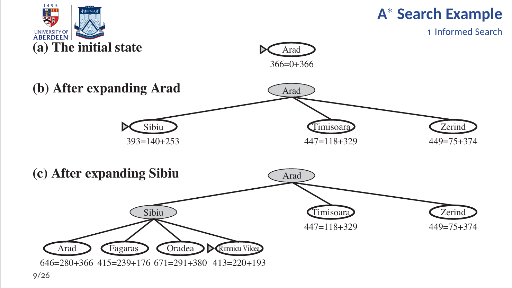
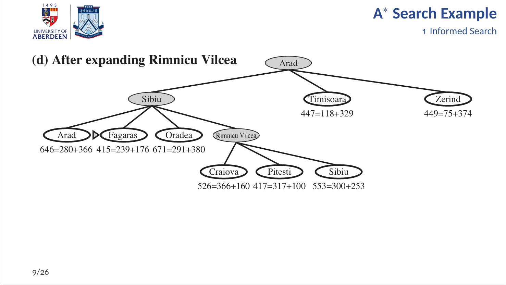
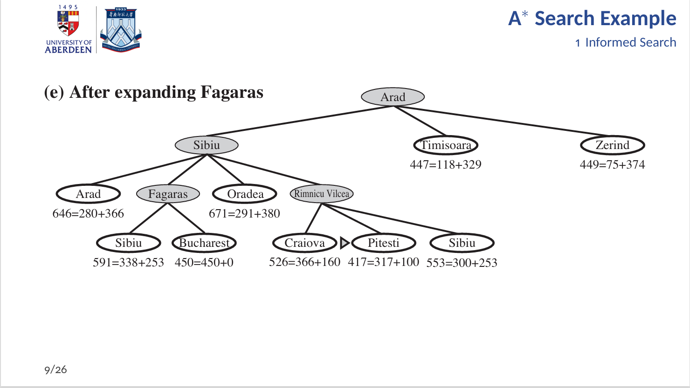
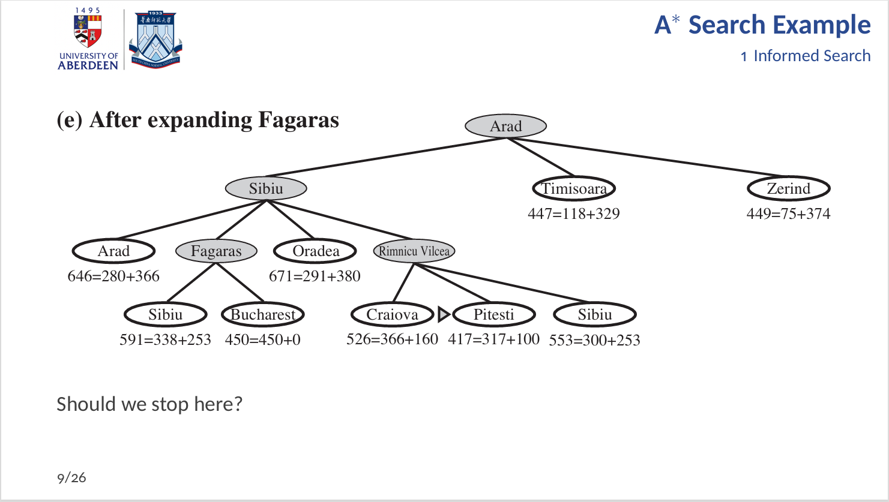
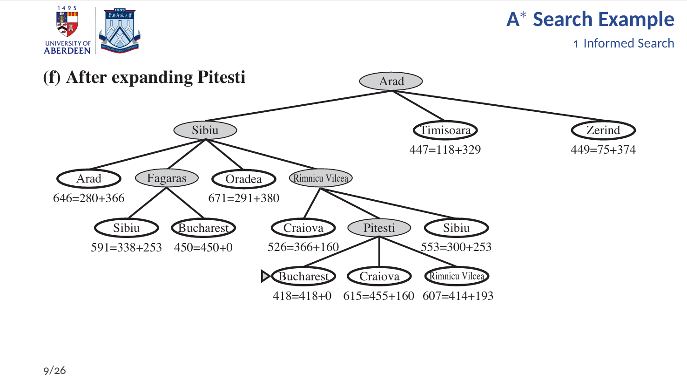
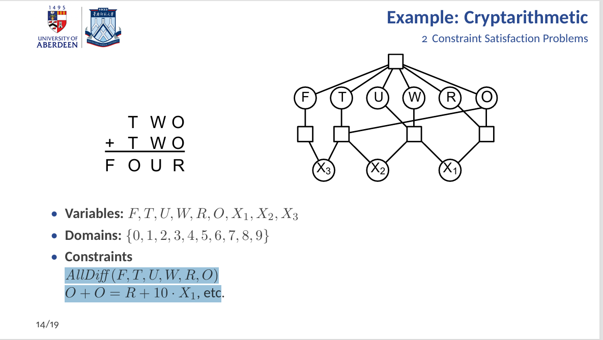
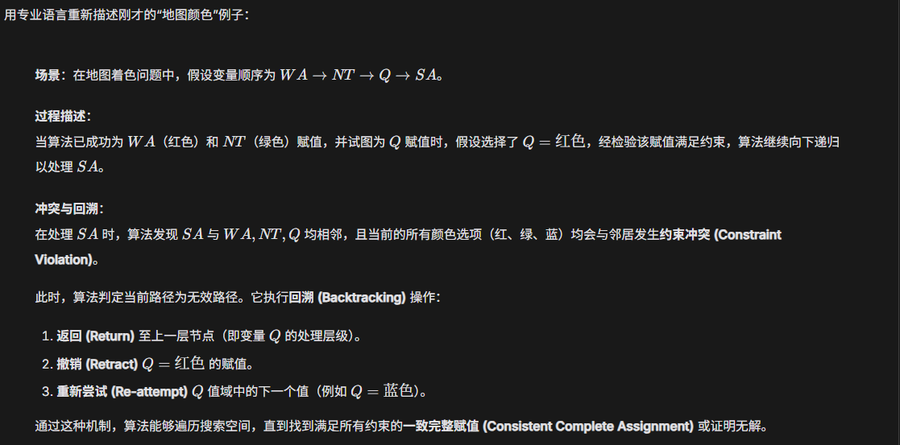

---
# 考点一：Definition of Turing Test

- Definition:
  - It is a operational test for determining whether a machine can exhibit intelligent behavior equivalent to, or indistinguishable from, that of a human.

---
# 考点二： A*Search: how to calculate the total cost of a node
**公式：**
$$f(n) = g(n) + h(n)$$

**各部分含义：**
*   **$f(n)$**：通过节点 $n$ 的最廉价解决方案的**总估计成本**（estimated cost of the cheapest solution through $n$）。
*   **$g(n)$**：**到达该节点的成本**（the cost to reach a node），即从起始点走到当前节点的实际路径消耗。
*   **$h(n)$**：**从该节点到目标节点的估计成本**（the cost to get from the node to the goal），这是由启发式函数（heuristic function）提供的估算值。

因此，计算方法是将“**从起点到当前的实际消耗**”与“**从当前到终点的预估消耗**”相加。

---

# 考点三：Primary issue of GraphPlan and how to alleviate it
- main question:
  - GraphPlan man generate a large number of ground atoms and most of them are irrelevant to the goal.
- solution
  - Only instantiate variables to terms of the same data type, thereby reducing unnecessary atomic generation.

---

# 考点四: STRIPS planning problem --> 机场航班调度场景下，为什么产生goal states的前置（predecessors）时，只考虑relevant actions是更高效的？

In STRIPS planning, especially in scenarios like airport scheduling where there are numerous objects (aircraft, cargo), the forward branching factor (several thousand) is much larger than the backward branching factor (approximately 20). Therefore, using Backward Search and only considering Relevant Actions can significantly reduce the number of states that need to be explored, thereby greatly improving the search efficiency.

`在STRIPS规划中，尤其是在像机场调度这样对象（飞机、货物）众多的场景里，前向分支因子（数千）远大于后向分支因子（约20）。因此，使用Backward Search并仅考虑Relevant Actions可以显著减少需要探索的状态数量，从而大幅提高搜索效率。`

---
# 考点五： Expected utility in decision making under uncertainty（定义，计算方法）
根据提供的课件（特别是第19页），关于**不确定性下的决策制定中的期望效用（Expected Utility）**的定义和计算方法如下：

### 1. 定义 (Definition)

在不确定性（Uncertainty）的环境中，执行一个非确定性动作（Nondeterministic action）$A$ 可能会导致多种不同的结果（例如 $Result_1(A), Result_2(A), \dots$）。因此，不能只根据单一结果来评估该动作的好坏。

**期望效用（Expected Utility, EU）** 是指在给定的证据 $E$ 下，执行动作 $A$ 后所有可能结果的效用值的**概率加权平均值**。

它结合了两个关键因素：
*   **概率（Probability）：** 某种结果发生的可能性。
*   **效用（Utility）：** 该结果对智能体（Agent）的合意程度（Desirability）。

### 2. 计算方法 (Calculation Method)

根据课件第19页的公式，给定证据 $E$，执行动作 $A$ 的期望效用计算如下：

$$ \mathbb{E}[U(A) \mid E] = \sum_{i} P(\text{Result}_i(A) \mid Do(A), E) \times U(\text{Result}_i(A)) $$

**公式组成部分解析：**

*   **$\sum_{i}$**：对动作 $A$ 可能产生的所有结果 $i$ 进行求和。
*   **$P(\text{Result}_i(A) \mid Do(A), E)$**：**概率项**。表示在当前状态下（基于证据 $E$），如果执行动作 $A$（$Do(A)$），结果 $i$ 发生的概率。这需要世界的一个因果模型（Causal model）。
*   **$U(\text{Result}_i(A))$**：**效用项**。表示结果 $i$ 的效用值（一个实数值，用来衡量该状态的合意程度）。

---
# 考点六：机器学习中bias-variance trade-off的重要性/意义

## Bias（偏差）
- Definiton：指模型预测的期望值与真实值之间的差异。简单来说，它衡量了模型本身的预测能力是否准确，即模型是否能捕捉到数据中真实、潜在的规律。
- Reason: 模型过于简单，其表达能力不足以学习到数据背后的复杂关系。例如，用一条直线去拟合一个明显是曲线的数据分布。
- Underfitting(欠拟合)：
  - 在训练集上表现不佳（错误率高）。
  - 在测试集上也表现不佳（错误率高）。
  -   - 模型未能从数据中学习到足够多的信息，无法捕捉到数据的基本趋势和模式。

## Variance(方差)
- Definition：指模型在不同的训练数据集上，其预测结果的波动性。它衡量了模型对训练数据中细微变化的敏感程度。
- Reason: 模型过于复杂，其表达能力太强，以至于它不仅学习了数据中的真实规律，还“记忆”了训练数据中的随机噪声和特定样本的细节。
- Overfitting(过拟合)：
  - 在训练集上表现优异（错误率低）。
  - 在测试集上表现不佳（错误率高）。
  - 模型过度关注训练数据中的噪声和异常值，导致其泛化能力下降，无法有效应用于新的、未见过的数据。

## 重要性
- 在机器学习中，我们的目标是构建一个模型，使其不仅能在训练数据（模型学习时看到的数据）上表现良好，更重要的是，它能在未见过的新数据（测试数据或实际应用中的数据）上依然保持优秀的预测能力，这被称为泛化能力。
- 偏差-方差权衡的核心思想是：在模型复杂度选择中，我们需要在偏差（导致欠拟合）和方差（导致过拟合）之间找到一个最佳平衡点，而不是单纯地最小化或最大化其中之一。因为这两个概念往往是此消彼长的关系。

---
# 考点七： 针对训练集中可能存在的数据偏见（data bias），有什么de-bias method？
- 增加模型复杂度
- 增加特征：引入更多与目标变量相关的特征，或者进行特征工程，创造更有效的特征。
- 减少正则化(Regularization)---(限制模型复杂度)：通过减少正则化项的权重，使模型能够更好地拟合训练数据，从而降低偏差。

PS: 以上方法主要针对减少偏差（bias）。如果数据偏见导致的是方差过大（overfitting）。
- 增加训练数据量
- 降低模型复杂度
- 特征选择/降维：移除不相关或冗余的特征，减少噪声。
- 正则化(Regularization)
- 集成学习：例如Bagging（如随机森林），通过组合多个模型的预测来减少方差。
- 提前停止：在训练过程中，当模型在验证集上的性能开始下降时就停止训练。

---
# 考点八： Explainable AI (XAI)的定义/内涵
Defition: 可解释人工智能（XAI）旨在开发技术，使人们能够理解、信任、有效地管理AI模型，并对AI模型做出更明智的决策。它回答的核心问题是：“为什么模型做出了这个预测/决策？”

- 内涵
  - 建立信任 (Trust)：如果用户、监管者不理解AI的决策过程，他们很难信任AI系统，尤其是在高风险领域（如医疗、金融、司法）。
  - 增强责任 (Accountability)： 当AI系统出错时，我们需要知道原因，并追究责任。可解释性有助于识别错误来源。
  - 调试和改进 (Debugging & Improvement)： 理解模型为何出错，有助于工程师发现问题、修复缺陷并改进模型性能。
  - 确保公平性 (Fairness Assurance)：XAI可以帮助我们检测模型是否存在隐藏的偏见和歧视，并提供改进的依据。
  - 满足法规要求 (Regulatory Compliance)： 欧盟的GDPR等法规已经明确要求AI决策必须具有可解释性（“解释权”）。
  - 科学发现 (Scientific Discovery)： 在科学研究中，AI不仅提供预测，还能揭示数据中隐藏的模式和关系。

---
# 考点九：给出Loaded/biased coin的单次（独立）抛掷时正反面的概率分布，求多次抛掷时某种组合的概率
根据你提供的 **Lecture 19 (Probabilities I)** 和 **Lecture 20 (Probabilities II)** 的课件内容，关于不均匀硬币（Loaded/Biased Coin）的概率分布及多次抛掷的计算方法如下：

### 1. 单次抛掷的概率分布 (Probability Distribution)
根据 **Lecture 19, Slide 18-22**，对于一枚不均匀硬币，其概率分布定义为：
*   **正面 (Heads) 概率**：$P(heads) = p$ (课件中举例 $p=0.75$ 或 $p=0.6$)
*   **反面 (Tails) 概率**：$P(tails) = 1 - p$
*   **公理**：$P(heads) + P(tails) = 1$

### 2. 多次抛掷（独立事件）的联合概率
根据 **Lecture 19, Slide 25-30** 以及 **Slide 35**，当多次抛掷硬币时，各次抛掷被视为**独立事件 (Independent)**。
对于独立事件 $A$ 和 $B$，联合概率遵循乘法规则：
$$ P(A \wedge B) = P(A) \times P(B) $$

#### 示例计算（基于 Slide 26-30 的 "Two Coin Flips 2"）：
假设硬币偏重，$P(H) = 0.6$，则 $P(T) = 0.4$。
抛掷两次的特定**序列**概率计算如下（真值表 Truth Table）：

| 第一次 (Flip-1) | 第二次 (Flip-2) | 计算公式 | 概率结果 |
| :--- | :--- | :--- | :--- |
| H | H | $0.6 \times 0.6$ | **0.36** |
| H | T | $0.6 \times 0.4$ | **0.24** |
| T | H | $0.4 \times 0.6$ | **0.24** |
| T | T | $0.4 \times 0.4$ | **0.16** |

### 3. 求某种“组合”的概率（不限顺序）
如果你要求的“组合”是指满足特定条件（如“恰好出现一次正面”），而不是特定顺序，课件中采用了**累加符合条件的所有情况**的方法。

根据 **Lecture 19, Slide 31-33 ("Two Coin Flips 3")** 的演示：
**问题**：求“恰好出现一次正面” ($P(\text{exactly one } H)$) 的概率。

**步骤**：
1.  列出所有可能的独立结果（如上表）。
2.  找出符合“恰好一个 H”的行：
    *   情况 1：(H, T) $\rightarrow$ 概率 $0.24$
    *   情况 2：(T, H) $\rightarrow$ 概率 $0.24$
3.  将这些概率相加：
    $$ P(\text{exactly one } H) = P(H, T) + P(T, H) = 0.24 + 0.24 = 0.48 $$

### 总结
基于课件的方法论：
1.  **特定顺序序列**：直接将每一次的概率相乘 ($P(outcome_1) \times P(outcome_2) \times \dots$)。
2.  **特定数量组合**（不限顺序）：先列出所有满足该数量要求的排列情况，算出每种排列的概率，然后将它们**相加**。

---
# 考点十：哪种学习范式（有监督、无监督、半监督、强化）用于train software agents to make sequential decisions？
- 监督学习(Supervised Learning):模型从带有标签（即正确答案）的训练数据中学习，目标是学会将输入映射到正确的输出。
  - 主要任务是：分类(Classification)`预测离散的类别标签`和回归(Regression)`预测连续的数值`。
- 无监督学习(Unsupervised Learning):模型从未标记的数据中学习，目标是发现数据中的隐藏模式或结构。
  - 主要任务是：聚类(Clustering)`将数据点分组`和降维(Dimensionality Reduction)`减少数据的特征数量`和关联规则学习(Association Rule Learning)`发现特征之间的关系`。
- 强化学习(Reinforcement Learning):模型通过与环境交互来学习，目标是通过试错法最大化累积奖励。
  - 主要任务是：训练智能体(Agent)在动态环境中做出一系列决策，以实现长期目标。
- 半监督学习(Semi-supervised Learning):结合了监督学习和无监督学习的元素，利用少量标记数据和大量未标记数据进行训练。
  - 主要任务是：在标记数据有限的情况下，提高模型的泛化能力。

- 答案：强化学习(Reinforcement Learning)用于训练软件智能体(software agents)做出序列决策(sequential decisions)。

---
# 考点十一：Traveling salesperson（给定地图）
### 给定损失函数G(n)和H(n)（其中n为节点编号），用A*算法找出某两个给定节点间的路径。


### Straight line distance heuristic-->What does it mean by “admissible heuristic”? Why does it matter?
- What does it mean by “admissible heuristic”?
  - A heuristic function $h(n)$is called `Admissible` if and only if it `never overestimates` the actual cost from the current node n to the target node. That is, $h(n) \le h^*(n)$.
  - 中文：一个启发函数$h(n)$被称为“可采纳的”，当且仅当她从不高估从当前节点n到目标节点的实际代价。即$h(n) \le h^*(n)$。
- Why does it matter?
  - The straight-line distance is `Admissible` because it represents the absolute minimum physical distance, and no actual movement (subject to rules and environment) can exceed this theoretical minimum limit. Therefore, it will never overestimate the `minimum cost of actually reaching the target`, thereby satisfying the condition that h(n) ≤ h*(n). This is the key property that ensures the A* algorithm can find the optimal solution.
  - 中文：直线距离是可采纳的，因为它代表了物理上的绝对最小距离，任何实际的移动（受限于规则和环境）都无法超越这个理论上的最小界限。因此，它永远不会高估实际到达目标的最小代价，从而满足 h(n) ≤ h*(n) 的条件。这是保证A*算法能找到最优解的关键性质。

---
# 考点十二：Backtracking in Constraint Satisfaction Problems

### 举例和定义Constraint Satisfaction Problems (CSP)---(20分)

- Definition: `It is made up for 3 components: (X, D, C)`
  - Variables(X): Variables are the "unknowns" or "undetermined items" in a problem, representing all aspects of our decision-making. Each variable needs to be assigned a value, and this value will form part of our solution. They are usually discrete and their quantity is limited.---`变量是问题中的“未知数”或“待定项”，它们代表了我们做出决策的各个方面。每个变量都需要被赋予一个值，而这个值将构成我们解决方案的一部分。它们通常是离散的，并且数量是有限的。`
  - Domains(D): A domain is the set of values that each variable can legally take. D_{i} is the field of the variable V_{i}. The size of the domain directly affects the scale of the search space. The smaller the domain, the lower the search difficulty is usually.---`域是每个变量可以合法取值的集合。D_{i} 是变量 V_{i} 的取值范围。域的大小直接影响搜索空间的规模。域越小，搜索难度通常越低。`
  - Constraints(C): Constraints are the most crucial part of a problem, as they define the combinations that are allowed or not allowed among variable values. A solution must satisfy all the constraints. Constraints can be very simple or extremely complex, but their core function is to reduce the degrees of freedom of variable values, thereby narrowing the solution space.---`约束是问题中最关键的部分，因为它们定义了变量值之间允许或不允许的组合。一个解决方案必须满足所有的约束。约束可以非常简单，也可以极其复杂，但它们的核心功能是减少变量值的自由度，从而缩小解空间。`
- Example: `Map Coloring Problem`
  - X: 地域上的区域缩写 {WA,NT,Q,NSW,V,SA,T}
  - D: 颜色的集合 {red, green, blue}
  - C: 相邻的区域不能有相同的颜色
- Example: `算术谜题 (Cryptarithmetic)` 
  - X: F,T,U,W,R,O,X1,X2,X3
  - D: {0,1,2,3,4,5,6,7,8,9}
  - C: 
    - AllDiff (F,T,U,W,R,O)
    - O + O = R + 10·X1, etc.
- Real-world Example: 
  - 排课问题 (Timetabling problems)：这就涉及课程、时间、教室的约束。
  - 分配问题 (Assignment problems)：谁教哪门课。
  - 硬件配置 (Hardware configuration)
  - 电子表格 (Spreadsheets)
  - 交通调度 (Transportation scheduling)
  - 工厂调度 (Factory scheduling)

### 给出回溯法的伪代码实现

#### 1. 伪代码原文 (Pseudocode)

```python
1:  function Backtracking-Search(csp) returns a solution or failure
2:      return Backtrack({}, csp)

3:  function Backtrack(csp, assignment) returns a solution or failure
4:      if assignment is complete then return assignment
5:      var <- Select-Unassigned-Variable(csp, assignment)
6:      for each value in Order-Domain-Values(csp, var, assignment) do
7:          if value is consistent with assignment then
8:              add {var = value} to assignment
9:              inferences <- Inference(csp, var, assignment)
10:             if inferences != failure then
11:                 add inferences to csp
12:                 result <- Backtrack(csp, assignment)
13:                 if result != failure then return result
14:                 remove inferences from csp
15:             remove {var = value} from assignment
16:     return failure
```

---

#### 2. 逐行详细解释 (Line-by-Line Explanation)

这个算法本质上是一个**深度优先搜索 (DFS)**。

##### **入口部分：启动搜索**

*   **第 1 行:** `function Backtracking-Search(csp) returns a solution or failure`
    *   **解释**：这是主函数，接收一个定义好的 CSP 问题（包含变量、值域、约束）。
*   **第 2 行:** `return Backtrack({}, csp)`
    *   **解释**：调用核心递归函数 `Backtrack`。
    *   **关键点**：初始的 `assignment`（赋值集合）是空的 `{}`，表示游戏刚开始，还没有给任何变量赋值。

##### **核心递归部分：尝试与回溯**

*   **第 3 行:** `function Backtrack(csp, assignment) returns a solution or failure`
    *   **解释**：这是递归函数。`assignment` 记录了当前已经确定的变量值（例如 `{WA=Red, NT=Green}`）。

**1. 终止条件 (Base Case)**
*   **第 4 行:** `if assignment is complete then return assignment`
    *   **解释**：如果赋值是**完整**的（即所有变量都有值了），说明找到了一个满足所有约束的解。
    *   **作用**：递归的终点，返回胜利结果。

**2. 选择变量 (Variable Selection)**
*   **第 5 行:** `var <- Select-Unassigned-Variable(csp, assignment)`
    *   **解释**：从还没赋值的变量里挑一个出来。
    *   **背诵点**：这里通常隐含了启发式策略（如 **MRV**：选剩余值最少的变量），目的是“先解决最难的”。

**3. 遍历取值 (Value Iteration)**
*   **第 6 行:** `for each value in Order-Domain-Values(csp, var, assignment) do`
    *   **解释**：对于选中的变量 `var`，尝试它值域里的每一个可能的 `value`。
    *   **背诵点**：这里隐含了 **LCV**（最少约束值）策略，目的是“先试最可能成功的”。

**4. 一致性检查 (Consistency Check)**
*   **第 7 行:** `if value is consistent with assignment then`
    *   **解释**：检查当前选的 `value` 是否与**已有**的 `assignment` 冲突。如果冲突（例如相邻地图同色），就跳过，不执行下面的代码（即“剪枝”）。

**5. 做出尝试 (Make a Move)**
*   **第 8 行:** `add {var = value} to assignment`
    *   **解释**：**核心步骤**。暂时假设 `var` 就取这个 `value`，把它加入赋值列表。

**6. 推理与前瞻 (Inference / Forward Checking)**
*   **第 9 行:** `inferences <- Inference(csp, var, assignment)`
    *   **解释**：**向前看**。既然我选了这个值，会不会导致其他未赋值的变量没值可选了？（例如前向检测 Forward Checking）。
*   **第 10 行:** `if inferences != failure then`
    *   **解释**：如果推理发现没有把路堵死，才能继续。
*   **第 11 行:** `add inferences to csp`
    *   **解释**：把推理结果（比如“变量B不能选红色了”）更新到 CSP 问题中，缩小搜索空间。

**7. 递归深入 (Recursive Call)**
*   **第 12 行:** `result <- Backtrack(csp, assignment)`
    *   **解释**：**递归**。带着更新后的 `assignment` 和 `csp`，去解决剩下的变量。
*   **第 13 行:** `if result != failure then return result`
    *   **解释**：如果子函数返回了成功（不是 failure），那就说明找到解了，一路向上返回结果。

**8. 回溯与撤销 (Backtracking / Undo)**
*   **第 14 行:** `remove inferences from csp`
    *   **解释**：**撤销推理**。代码走到这里，说明第 12 行递归失败了（下面的路走不通）。既然路走不通，就要把第 11 行加的限制删掉。
*   **第 15 行:** `remove {var = value} from assignment`
    *   **解释**：**撤销赋值**。把第 8 行做的决定撤回。我们要把状态恢复原样，以便在 `for` 循环中尝试下一个 `value`。
    *   **重点**：这就是“回溯”一词的由来，**有借（Add）必须有还（Remove）**。

**9. 失败返回 (Failure)**
*   **第 16 行:** `return failure`
    *   **解释**：如果 `for` 循环试遍了所有的值，要么冲突，要么递归下去都是死胡同，说明当前分支无解。返回失败，回退到上一层节点。

---

#### 默写技巧总结

如果你要默写这个算法，记住这 **4 个步骤的循环**：

1.  **Check Success**: 满了没？满了就返回。
2.  **Select**: 挑一个没赋值的变量。
3.  **Loop Values**: 遍历它的每一个值。
    *   **Check Valid**: 合法吗？
    *   **Do**: 赋值 + 推理 (Add)。
    *   **Recurse**: 递归调用。
    *   **Undo**: 撤销推理 + 撤销赋值 (Remove)。
4.  **Fail**: 都试过了不行，返回失败。

### 解释并举例说明backtracking如何解决Constraint Satisfaction Problems.
- Reason: 
  - Backtracking is a DFS algorithm that aims to solve CSPs, due to it use incrementally way to generate solutions.
  - When algorithm find the current patrial assigement cannot be extended to a complete solution, it will Retract the most recent assignment, restore to the previous state, and attempt the next candidate value in the variable's value range.
- Example: MAP
  - 

---

# 考点十三：Backward search vs. forward search in AI planning.（with example）

### Backward search
- features:
  - begin from the goal state and work backwards to the intial state
  - Compute the Predecessor State of some action that can achieve the goal
  - only care about the revelant actions

### forward search
- features:
  - begin from the initial state and work forwards to the goal state
  - Apply actions to generate subsequent states until a state is found that meets the target test.
  - consider all possible actions

### Example: airport scheduling
- forward search
  - If you begin from th intial state, you have to consider all possible actions, leading to a large number of actions(serveral thousand) behind intial state.
  - You can load any piece of cargo onto any aircraft or have any aircraft fly to any airport.（Example）
  - It will make the search tree very wide and deep and hard to find the correct path to goal state
- backward search
  - if you begin from the goal state, you only need to consider the relevant actions that can lead to the goal state, resulting in a much smaller number of actions(about 20) before the goal state.
  - Like: What actions can directly cause goods A to be in JFK?
  - This will significantly reduce the widtha and depth of the search tree, the Search space of Backward Search is much smaller than that of Forward Search.

---

# 考点十四：房价预测问题

### 选择损失函数的形式（MSE、CE）
- Choose MSE for the cost function
- Reason
  - House price prediction is a regression task, because we want a continuous value. And MSE is commonly used for regression tasks as it measures the average squared difference between predicted and actual values, effectively penalizing larger errors.---`房价预测是一个回归任务，因为我们想要一个连续的值。MSE通常用于回归任务，因为它测量预测值和实际值之间的平均平方差，有效地惩罚较大的误差。`
  - The CE algorithm is mainly used for classifition tasks.

### 定义目标函数

设假设函数 (Hypothesis) 为线性模型：
$$ h_w(x^{(i)}) = w_0 + w_1x^{(i)} $$

则**目标函数 (Cost Function / Loss)** 定义为：
$$ Loss(w_0, w_1) = \frac{1}{2m} \sum_{i=1}^{m} \left( h_w(x^{(i)}) - y^{(i)} \right)^2 $$

*   其中 $m$ 是训练样本的数量。
*   我们的目标是找到 $w_0, w_1$ 使得该函数最小化：
    $$ \min_{w_0, w_1} Loss(w_0, w_1) $$


#### 1. 公式的拆解理解

$$ Loss(w_0, w_1) = \color{red}{\frac{1}{2m}} \sum_{i=1}^{m} \left( \color{blue}{h_w(x^{(i)}) - y^{(i)}} \right)^{\color{green}{2}} $$

*   **蓝色部分 $\left( h_w(x^{(i)}) - y^{(i)} \right)$**：
    *   这是 **误差 (Error)**。即模型预测的值 $h_w$ 减去 真实值 $y$。
*   **绿色部分 $(\dots)^2$**：
    *   这是 **平方 (Squared)**。
    *   作用1：消除正负号的影响（预测多了或少了都算误差）。
    *   作用2：**放大大的误差**。如果预测偏离很远，平方后惩罚会非常大，迫使模型尽快修正。
*   **$\sum$ (求和)**：
    *   把所有 $m$ 个样本的误差加起来。
*   **$\frac{1}{m}$**：
    *   这是 **均值 (Mean)**。除以样本数量，保证损失函数的大小不会因为样本数量增多而变得巨大，让不同规模的数据集可以比较。

所以，核心部分就是：**Mean (均值) Squared (平方) Error (误差)**。


#### 2. 为什么前面是 $\frac{1}{2m}$ 而不是 $\frac{1}{m}$？

*“平均值不是应该除以 $m$ 吗？为什么这里除以 $2m$？”*

这是一个**数学上的便利技巧**，是为了方便**第3步（计算梯度）**。

当你对这个损失函数求导数（计算梯度）时，根据**求导的链式法则**，指数上的 **2** 会落下来：

$$ \frac{d}{dx} (x^2) = 2x $$

如果我们原本的系数是 $\frac{1}{2m}$，那么求导时：

$$ 2 \times \frac{1}{2m} = \frac{1}{m} $$

**这个 $\frac{1}{2}$ 正好把求导产生的 2 抵消掉了**。这样你的梯度更新公式（课件 Slide 13）就会变得非常整洁，没有多余的常数系数：

$$ \text{梯度} = \frac{1}{m} \sum (h(x) - y) \cdot x $$

**总结：**
*   在**统计学**评估指标中，MSE 就是除以 $m$。
*   在**机器学习优化（梯度下降）**中，为了计算方便，我们定义损失函数 $J(w)$ 或 $Loss$ 时通常除以 $2m$。
*   **这不会影响结果**：因为 $\min \frac{1}{m} (\dots)$ 和 $\min \frac{1}{2m} (\dots)$ 得到的最小值点（即最优的 $w_0, w_1$）是完全同一个位置。

### 计算梯度并给出参数更新的算式
#### 1. 设定场景与初始值

假设我们有 $m=2$ 个训练样本（为了计算方便，数据很简单）：

*   **样本 1**: 房子面积 $x^{(1)} = 1$, 真实价格 $y^{(1)} = 2$
*   **样本 2**: 房子面积 $x^{(2)} = 2$, 真实价格 $y^{(2)} = 4$
    *   *(肉眼可见，完美的规律是 $y = 2x$，即 $w_0=0, w_1=2$)*

我们初始化参数（故意设一个不准的值，看算法怎么修正它）：
*   $w_0 = 0$ (偏置项)
*   $w_1 = 1$ (权重项，斜率)
*   **学习率 $\alpha = 0.1$**


#### 第一阶段：计算梯度 (Calculate Gradients)

我们要计算两个偏导数（梯度）：
1.  针对 $w_0$ 的梯度：$\frac{\partial}{\partial w_0} Loss$
2.  针对 $w_1$ 的梯度：$\frac{\partial}{\partial w_1} Loss$

##### 步骤 1：计算预测值 (Prediction) $h_w(x)$
公式：$h_w(x) = w_0 + w_1x$

*   **样本 1**: $h(x^{(1)}) = 0 + 1 \times 1 = \mathbf{1}$
*   **样本 2**: $h(x^{(2)}) = 0 + 1 \times 2 = \mathbf{2}$

##### 步骤 2：计算误差项 (Error)
公式：$Error = h_w(x^{(i)}) - y^{(i)}$

*   **样本 1**: $1 - 2 = \mathbf{-1}$ (预测少了)
*   **样本 2**: $2 - 4 = \mathbf{-2}$ (预测少了)

##### 步骤 3：代入梯度公式

**A. 计算 $w_0$ 的梯度**
公式：$\frac{1}{m} \sum (h_w(x^{(i)}) - y^{(i)})$
即：**(误差之和) / 样本数**

$$
\begin{aligned}
\frac{\partial Loss}{\partial w_0} &= \frac{1}{2} \left[ \underbrace{(-1)}_{\text{样本1误差}} + \underbrace{(-2)}_{\text{样本2误差}} \right] \\
&= \frac{1}{2} [-3] \\
&= \mathbf{-1.5}
\end{aligned}
$$

**B. 计算 $w_1$ 的梯度**
公式：$\frac{1}{m} \sum (h_w(x^{(i)}) - y^{(i)}) \cdot x^{(i)}$
即：**(误差 $\times$ 对应的x 输入) 的平均值**

$$
\begin{aligned}
\frac{\partial Loss}{\partial w_1} &= \frac{1}{2} \left[ \underbrace{(-1) \cdot 1}_{\text{样本1: 误差}\times x} + \underbrace{(-2) \cdot 2}_{\text{样本2: 误差}\times x} \right] \\
&= \frac{1}{2} [-1 + (-4)] \\
&= \frac{1}{2} [-5] \\
&= \mathbf{-2.5}
\end{aligned}
$$


#### 第二阶段：参数更新 (Parameter Update)

现在我们有了梯度，利用梯度下降公式来更新 $w_0$ 和 $w_1$。
公式：$w_{new} = w_{old} - \alpha \times \text{gradient}$

**A. 更新 $w_0$**
$$
\begin{aligned}
w_0 &:= 0 - 0.1 \times (-1.5) \\
w_0 &:= 0 + 0.15 \\
w_0 &:= \mathbf{0.15}
\end{aligned}
$$

**B. 更新 $w_1$**
$$
\begin{aligned}
w_1 &:= 1 - 0.1 \times (-2.5) \\
w_1 &:= 1 + 0.25 \\
w_1 &:= \mathbf{1.25}
\end{aligned}
$$


### 结果分析 (为什么要这样做？)

经过这一轮更新后：
*   **$w_1$ 从 1 变成了 1.25**。
    *   因为真实斜率是 2，初始值 1 太小了。
    *   梯度是负的 (-2.5)，说明我们在“下坡”。
    *   减去负梯度等于加上正数，所以 $w_1$ **增大**了，向着正确答案 (2) 靠近了一步。

---